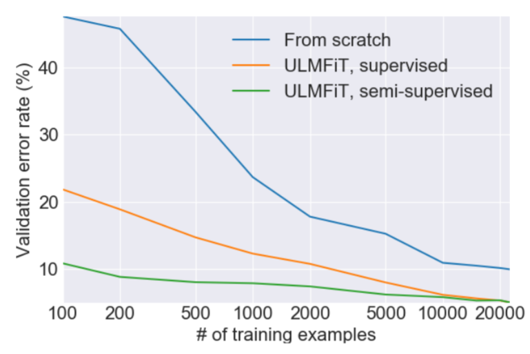

# Machine Learning & Deep Learning Notebooks

These are my jupyter notebooks on ML & DL.

## Libraries used in these notebooks:
* [Pytorch](https://pytorch.org/) Deep Learning Framewrok.
* [Fastai](https://docs.fast.ai/) For training fast and accurate NNs using modern best practices.
* [Scikit-learn](https://scikit-learn.org/stable/) For Machine learning algorithms.
* [Pandas](https://pandas.pydata.org/) For data manipulation.
* [Spacy](https://spacy.io/) For NLP processing. 

----
## Tabular Data

* [Using Random Forests to predict income from Tabular Data](Adult-Census-Data/adult-census-data-randomforest-fastai-processing.ipynb).
* [Using Deep Neural Networks to predict income from Tabular Data](Adult-Census-Data/adult-census-data-dnn-with-fast-ai.ipynb)

----

## Computer Vision

* [Using a **MLP** (Multi Layer Perceptron) to classify images from the MNIST dataset.  Written in vanilla **Pytorch**](mnist_mlp_pytorch.ipynb) 
* [Using a **CNN** (Convoloution Neural Network) to classify images from the CIFAR-10 dataset. Written in vanilla **Pytorch**.](cifar10_cnn_pytorch.ipynb)
* [Using **Transfer learning** to fine-tune a **Resnet** pre-trained on Imagenet to recognize Arabic handwritten characters.](Arabic-Handwritten-recognition-CNN.ipynb) Acheiving SOTA result ~98% Accuracy.

----

## NLP (Natural Language Processing)

#### Publishing the SOTA pre-trained Language model for Arabic Language trained  on ~800,000 Wikipedia articles following the paper [ULMFiT (Universal Language Model Fine-tuning for Text Classification)](https://arxiv.org/abs/1801.06146) .

#### The published Language model weights are available [here](http://storage.googleapis.com/ulmfit-arabic-v1.tar.gz) and can be used for a variety of NLP tasks like (Sentiment Analysis, Text Generation ) and any other task that require the model to have an understanding of the language semantics.

#### Simple transfer learning using just a single layer of weights (embeddings) has been extremely popular for some years, such as the word2vec embeddings from Google However, full neural networks in practice contain many layers and can encompass much more details about the language and many implementations for this idea have emerged in the last year like [ULMFit](https://arxiv.org/abs/1801.06146), [ELMo](https://allennlp.org/elmo), [GLoMo](https://arxiv.org/abs/1806.05662), [OpenAI transformer](https://openai.com/blog/language-unsupervised/), [BERT](https://arxiv.org/abs/1810.04805).

### Below are some examples of using the pre-trained language model in NLP tasks :

* Classification of [HARD (Hotel Arabic Reviews Dataset)](https://github.com/elnagara/HARD-Arabic-Dataset) :
    * This dataset contains 93700 hotel reviews in Arabic language. The hotel reviews were collected from Booking.com website during June/July 2016. The reviews are expressed in Modern Standard Arabic as well as dialectal Arabic

    * [Notebook](HARD-Classifier/Balanced-HARD-classifier.ipynb) using the balanced reviews file (50 % neg, 50% pos).
    * [Notebook](HARD-Classifier/Unbalanced-HARD-classifier.ipynb) unsing the unbalanced reviews file (13% neg, 19% ntl, 68% pos).

    * Both notebooks achieve a better result **(+4% in F1-score)** than the one published in the assosiated [paper](https://link.springer.com/chapter/10.1007%2F978-3-319-67056-0_3)

* Classification of [BRAD (Books Reviews in Arabic Dataset)](https://github.com/elnagara/BRAD-Arabic-Dataset) :
    * This dataset contains 510,600 book reviews in Arabic language. The reviews were collected from GoodReads.com website during June/July 2016. The reviews are expressed mainly in Modern Standard Arabic but there are reviews in dialectal Arabic as well.

    * [Notebook](BRAD-Classifier/Balanced-BRAD-classifier.ipynb) using the balanced reviews file (50 % neg, 50% pos).
    * [Notebook](BRAD-Classifier/Unbalanced-BRAD-classifier.ipynb) uses the unbalanced reviews file (9% neg, 12% ntl, 79% pos).

* Sentiment Analysis for [Arabic Tweets](https://github.com/bakrianoo/Datasets/tree/master/Arabic%20Tweets):
    * This dataset contains A corpus of Arabic tweets (2,104,671 Positive tweets, 2,313,457 Negative Tweets)categorized based on some emoji characters appearance.
    * [Notebook](Arabic-Tweets-Classifier.ipynb) Although most of the tweets in this dataset are in dialectal Arabic while the language model is mostly trained on standard Arabic the model achieves **+90% classification accuracy** it can even recognize how emojis affect the sentiment of the tweet.

* Text generation using previous Tweets from the [Twitter API](https://developer.twitter.com/en/apply-for-access):
    * [Notebook](Elbaradei-tweet-generator.ipynb) This is a proof of concept, it needs more research from me on text generation and also needs more data but it's a fun experiment to play with and can generate some fun results :D .

---
## Prerequisites:
* `Python3.6`
* `fastai 1.0.51.dev0` 

    after normal installation use
    ` pip install git+https://github.com/fastai/fastai.git`
    to get the bleeding edge version needed for some QRNN fixes.

**Every notebook contains links to download the dataset it uses, create a `data` folder to store the downloaded files.**

 **Every notebook contains more details about the specific implementaions of the model used.**